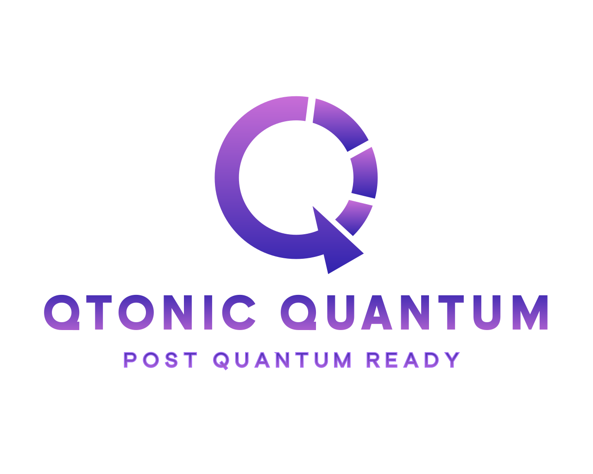

 

# Qtonic Quantum — leading quantum risk and vulnerability intelligence tools and services

**We take enterprises from current cryptographic state, through hybrid, to post-quantum.**

Quantum Risk and Vulnerability Intelligence and Post-Quantum Cryptography.

Cryptographic risk intelligence platform helping enterprise organizations measure exposure, validate what matters, and govern post-quantum migration.

## Public Tools

| Repo | What |
|------|------|
| [cbom-cyclonedx-examples](https://github.com/qtonicquantum/cbom-cyclonedx-examples) | Reference CycloneDX 1.7 Cryptographic Bills of Materials |
| [pqc-readiness-cli](https://github.com/qtonicquantum/pqc-readiness-cli) | Local cryptographic asset inventory; emits CycloneDX 1.7 CBOM |
| [awesome-pqc](https://github.com/qtonicquantum/awesome-pqc) | Curated post-quantum cryptography resources |

## Services

QScout (cryptographic assessment) · QStrike (governed follow-on validation) · QSolve (PQC migration)

Visit [qtonicquantum.com](https://qtonicquantum.com).

## What Qtonic Quantum does

**We take enterprises from current cryptographic state, through hybrid, to post-quantum.**

Four pillars deliver the journey:

- **QScout** — cryptographic assessment (current-state discovery and risk scoring)
- **QStrike** — governed follow-on validation (proves what is exploitable)
- **QSolve** — PQC migration (executes the move to hybrid then post-quantum)
- **Q-Lab** — independent public scoring registry (credentials the work)

### Why Qtonic Quantum

- **Leading intelligence tools** — credentialed by our own public Q-Lab scoring registry, not vendor self-reports.
- **Our own labs** — Q-Lab is built and operated in-house.
- **Founder-funded and independent** — no outside funding, no vendor distribution agreements. 100% vendor neutral, client focused.

---

From Qtonic Quantum — leading quantum risk and vulnerability intelligence tools and services. Visit https://qtonicquantum.com.
